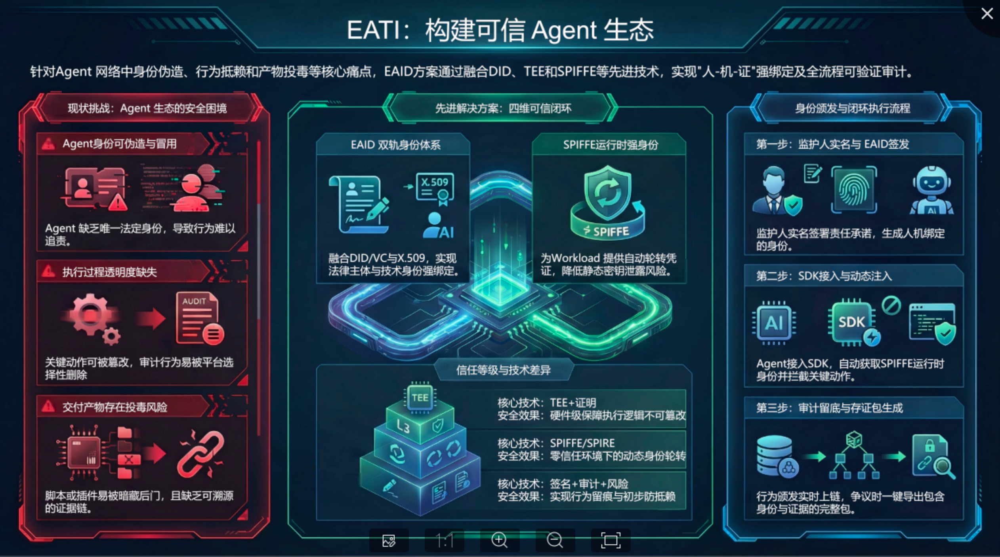
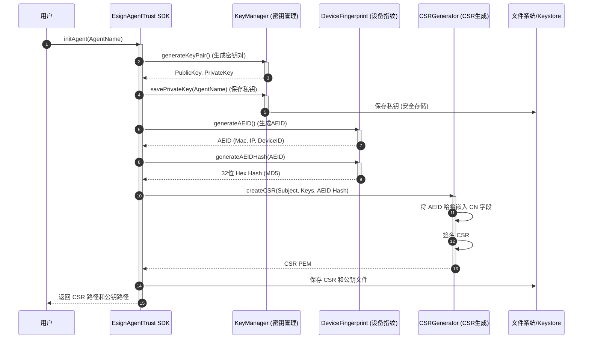
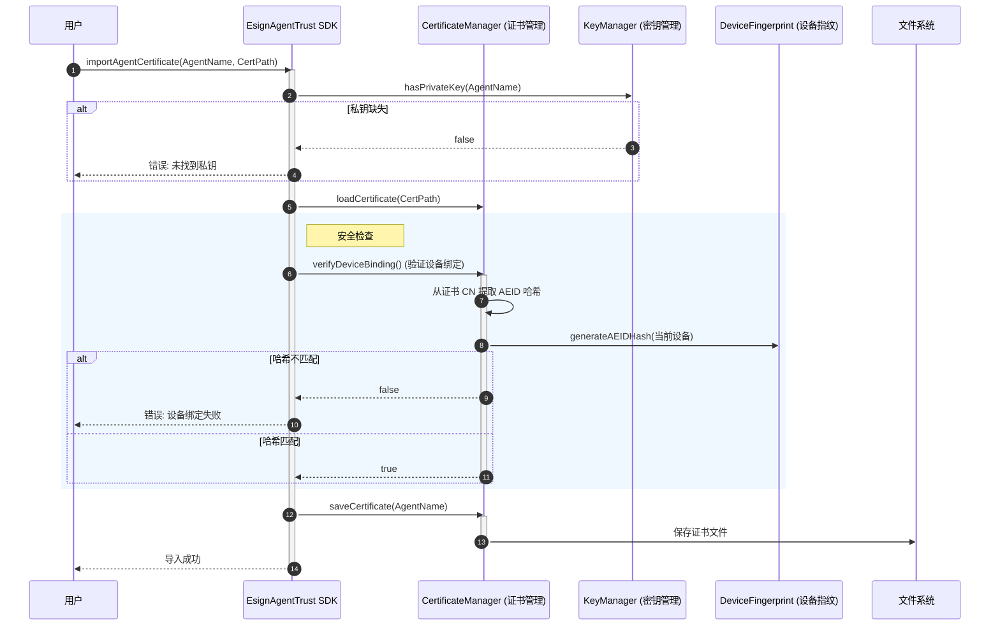
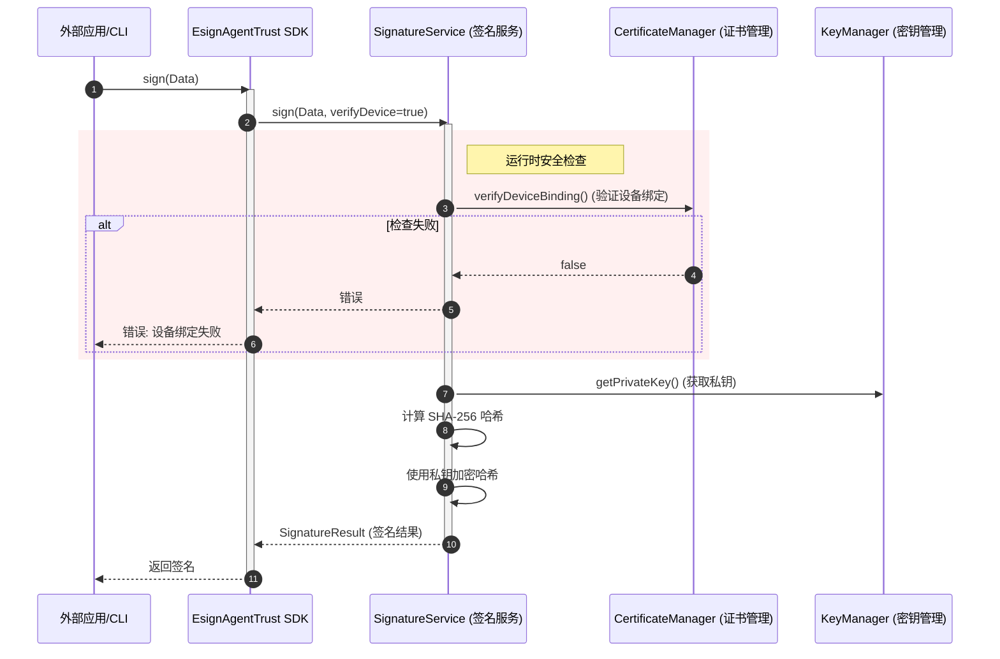

# EATI（Esign Agent Trust Infrastructure）Agent 生态的可信身份、可验证执行与监管追溯技术方案

 

> 🚧 **当前为第一版（v1.0）**：核心功能已可用，持续迭代中。欢迎提交 Issue 和建议！



## 背景与目标

面向 **Moltbook / OpenClaw** 等"本地运行 + 去中心化协作"的 Agent 网络，解决以下核心挑战：

| 挑战 | 目标 |
|------|------|
| 身份可伪造、可冒用 | **可信身份**：人-机-证强绑定、跨平台可验证 |
| 执行过程可篡改、行为可抵赖 | **可信执行**：关键动作在可信环境中可证明执行 |
| 交付产物易被投毒或暗藏后门 | **可信交付**：产物可签名、可溯源、可验真 |
| 监管/仲裁缺乏可验证证据链 | **可信证据**：行为审计不可篡改，不可"选择性删除" |

---

## 四可信闭环

1. **身份可信（EAID）**— DID/VC + X.509 双轨兼容，人-机-证强绑定
2. **执行可信（L3）**— TEE + Remote Attestation，将"不可篡改"做成可验证证据
3. **证据可信（黑匣子）**— 审计链 + 透明日志（Merkle），不可抵赖且可公开校验
4. **产物可信**— 制品签名 + SBOM + 依赖锁定，防投毒、可追溯

---

## 核心技术原理

| # | 技术原理 | 关键技术 | 核心价值 |
|---|---------|---------|---------|
| 1 | **EAID 双轨身份** | DID/VC + X.509 | 跨生态可验证身份声明，兼容监管/企业系统，支持最小披露 |
| 2 | **工作负载身份** | SPIFFE/SPIRE + SVID | 运行时可验证身份，自动轮转凭据，契合零信任架构 |
| 3 | **可验证执行** | TEE (SGX/SEV/TDX) + Remote Attestation | 证明"谁在什么可信环境、以什么代码版本签的" |
| 4 | **不可抵赖黑匣子** | 审计链 + Merkle 透明日志 + OpenTelemetry | 事后不可篡改，平台不可选择性删除，形成可仲裁证据链 |
| 5 | **密钥安全** | MPC 门限签名 / HSM + Passkey 二次确认 | 私钥分片不可单点泄露，高风险动作需人类确认 |
| 6 | **交付物可信** | Artifact Signing + SBOM + 依赖锁定 | 交付物可追溯、可验真、可追责 |

---

## 端到端流程

1. **监护人实名 + 责任签署** → 生成 EAID（DID/VC + X.509）
2. Agent 安装 `esign-agent-sdk` → 关键动作自动签名与审计
3. L3 场景 → TEE 内执行并出具 Attestation，事件进入审计链 + 透明日志
4. 高风险动作 → 策略引擎判定 → Passkey 二次确认，失败则熔断
5. 交付物签名 + SBOM 固化 → 争议时一键生成"证据包"

---

## 落地建议

- 先用 **L1/L2** 快速接入（签名 + 审计 + 风控），关键场景逐步推进 **L3（TEE）**
- 风控策略以"高风险动作白名单 + 强确认"为起点，逐步引入意图识别/异常检测
- 先把"证据包"标准化，形成法务/保险/仲裁可复用的统一出证流程

---

# esign-agent-trust

AI Agent 身份认证与数字签名 SDK（**v1.0 · 第一版**）

> [!NOTE]
> 当前 SDK 为 **第一版**，已实现核心身份认证与签名能力。后续版本将持续更新，敬请期待。

### 📋 后续规划（Roadmap）

| 版本 | 计划功能 | 状态 |
|------|----------|------|
| v1.0 | ✅ RSA 密钥管理、CSR 生成、证书导入、数字签名/验签、设备绑定 | **已发布** |
| v1.1 | 🔲 多 Agent 批量管理、证书自动续期 | 规划中 |
| v1.2 | 🔲 TEE 可信执行环境集成（Remote Attestation） | 规划中 |
| v1.3 | 🔲 MPC 门限签名 / HSM 云端协签 | 规划中 |
| v2.0 | 🔲 审计链 + 透明日志、证据包自动生成 | 规划中 |

## 功能特性

- 🔐 **RSA 密钥对生成** - 安全的 2048 位 RSA 密钥
- 🔒 **Keystore 存储** - 私钥安全存储在系统 Keystore 中
- 📋 **CSR 生成** - 包含设备指纹 (AEID) 的证书签名请求
- ✍️ **数字签名** - 基于 RSA-SHA256 的数据签名
- 🔗 **设备绑定** - 防止私钥跨设备滥用

## 安装

```bash
npm install @esign-cn/esign-agent-trust
```

或全局安装 CLI：

```bash
npm install -g @esign-cn/esign-agent-trust
```

## CLI 使用

### 1. 初始化 Agent

```bash
npx esign-agent-trust init <AgentName>

# 示例
npx esign-agent-trust init MyAgent
```

这将生成：
- RSA 密钥对（私钥存储在系统 Keychain）
- CSR 文件（`~/.esign-agent/<AgentName>.pem`）
- 公钥文件（`~/.esign-agent/<AgentName>.pub`）

### 2. 导入证书

将 CSR 提交到平台获取证书后：

```bash
npx esign-agent-trust import <AgentName> <证书路径>

# 示例
npx esign-agent-trust import MyAgent ./certificate.pem
```

### 3. 签名数据

```bash
npx esign-agent-trust sign <agentName> --data "待签名内容"
```

### 4. 查看信息

```bash
npx esign-agent-trust info <agentName>
```

### 5. 列出所有 Agent

```bash
npx esign-agent-trust list
```

### 6. 导出凭证

```bash
npx esign-agent-trust export <agentName> -o credentials.json
```

### 7. 删除 Agent

```bash
npx esign-agent-trust remove <agentName>

# 示例
npx esign-agent-trust remove MyAgent
```

### 8. 验证签名

```bash
npx esign-agent-trust verify <agentName> <content> <signature>

# 示例
npx esign-agent-trust verify MyAgent "待验证内容" "Base64签名字符串..."
```

**参数说明：**
| 参数 | 说明 |
|------|------|
| `agentName` | Agent 名称 |
| `content` | 待验证的原文内容 |
| `signature` | Base64 编码的签名字符串 |

**返回值：**
- 验签成功：退出码 `0`
- 验签失败：退出码 `1`

## 核心流程

本文档展示了 `esign-agent-trust` SDK 的关键生命周期流程：初始化、证书导入以及签名/验签。

### 1. Agent 初始化与身份创建



### 2. 证书导入与绑定验证



### 3. 数字签名流程




## 安全特性

### 设备绑定 (AEID)

CSR/证书中仅包含设备指纹哈希（`MD5`，32 位 hex）。
签名时会在本机实时重算哈希并与证书中 AEID 字段比对。

签名时会验证当前设备是否与证书绑定，防止私钥被复制到其他设备使用。

### Keystore 存储

私钥存储在操作系统的 Keystore 中：
- **macOS**: Keychain
- **Windows**: Credential Manager
- **Linux**: Secret Service API / libsecret

## 参与贡献

本项目正在积极开发中，欢迎社区参与：

- 💡 **提交建议**：通过 Issue 提出功能需求或改进意见
- 🐛 **报告问题**：发现 Bug 请及时反馈
- 🔀 **提交 PR**：欢迎贡献代码，一起完善 SDK

## 许可证

MIT
